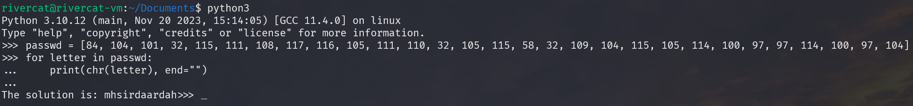

# Training-ASCII

**American Standard Code for Information Interchange** (short for ASCII) is a character encoding standard for electronic communication, represent text in computers, telecommunications equipment, and other devices.

Actually letter is not really letter in computer world, every letter in computer are number.

## Tip

* Using ASCII table to get information

* Online tools

* Programming language

## Solution

Here I will using python because it already in Ubuntu system.

