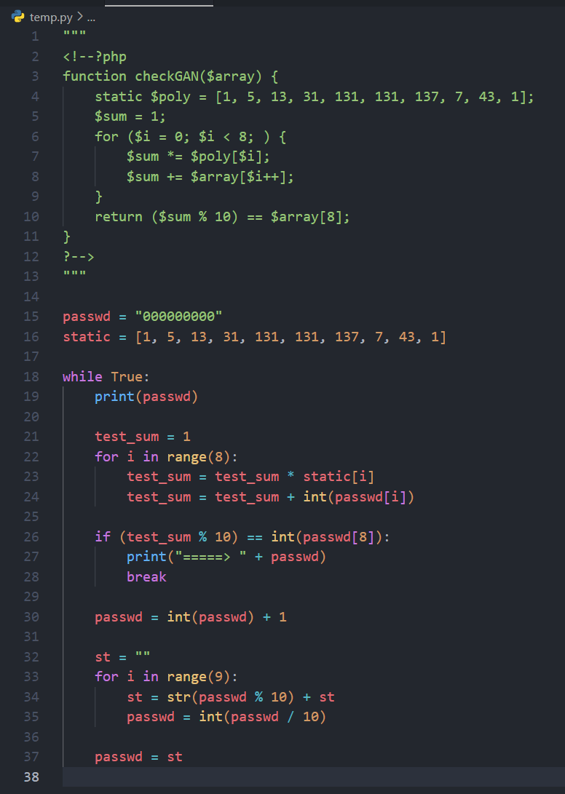
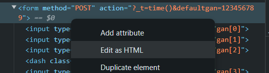

# Training-Checksums

This challenge need to enter the password for pass it.

## Tip

...

## Solution

1. In this challenge have another website, we can go there, nothing happen.

1. Let us check source code to get some information

1. Here we see a comment and it's php code, and seems like password check function, just run a small program and finish this password.

    

1. Then we can saw another problem is no submit button, so... let's create it.

    

1. After click "Edit as HTML" then add ``<input type="submit">`` and you will see a new black button

1. enter the password then click button. (if too black you can change background color)
